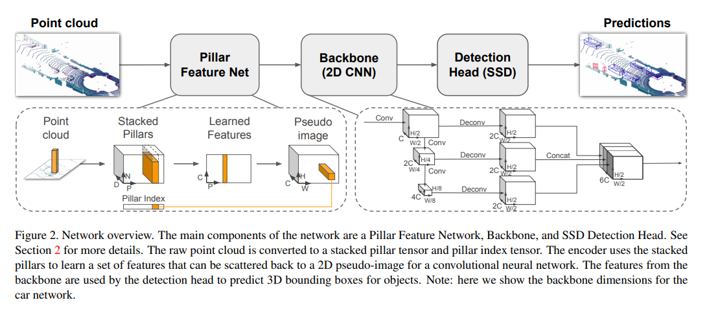

### 00. Title
PointPillars: Fast Encoders for Object Detection from Point Clouds 
### 01. Authors
Alex H. Lang, Sourabh Vora, Holger Caesar, Lubing Zhou, Jiong Yang (Oscar Beijbom, nuTonomy)
### 02. Background
Currently there are two types of encoders:

fixed encoders tend to be fast but sacrifice accuracy, learning encoders are more accurate but slower.

### 03. Contributions
1. propose a novel point cloud encoder and network, that operates on the point cloud to enable end-to-end training of a 3D object detection network.
2. all computations on pillars can be posed as dense 2D convolutions which enables inference at 62 Hz.
3. demonstrate SOTA perfermance on KITTI's BEV and 3D benchmark.

### 04. Implementation Details
backbone:

### 05. Questions
what's my questions

### 06. Further Reading

MV3D, AVOP, VoxelNet, Frustum PointNet