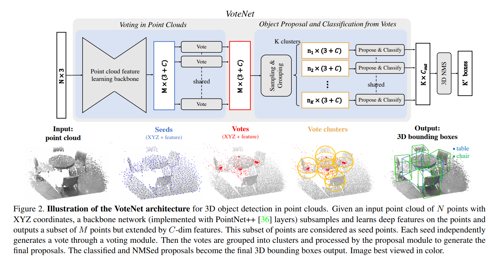

### 00. Title
Deep Hough Voting for 3D Object Detection in Point Clouds
### 01. Authors
Charles R Qi, Or Litany, Kaiming He, Leonidas J. Guibas (Facebook AI Research, Stanford)
### 02. Background
a major challenge when directly predicting bounding box parameters from 3D scene points: a 3D object centroid can be far from any surface point.
### 03. Contributions
1. reformulating Hough Voting in the contex of deep learning, and generate new points that lie close to object centers;
2. SOTA 3D object detection performance on SUN RGB-D and ScanNet dataset;
3. in-depth analysis of the importance of voting for 3D object detection in point clouds.

### 04. Implementation Details
network structure

### 05. Questions
what's my questions

### 06. Further Reading