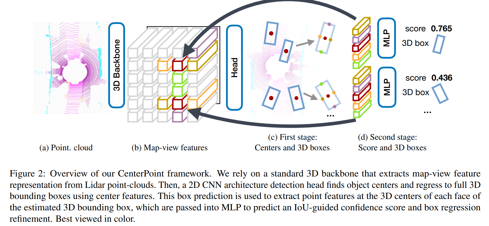

### 00. Title
Center-based 3D Object Detection and Tracking
### 01. Authors
Tianwei Yin, Xingyi Zhou, Philipp Krahenbubl (UT Austin)
### 02. Background
Objects in a 3D world do not follow any particular orientation, and box-based detectors have difficulties enumerating all orientations or fitting an axis-aligned bounding box to rotated objects.
### 03. Contributions
Use center-based network to do detection and tracking, out-performs other methods in Waymo and nuScenes datasets. 

### 04. Implementation Details
Network Structure:

Detection process:

1. detect centers of objects using a keypoint detector and regress to other attributes.
2. refines the estimates using additional point features.

Tracking:

1. simplifies to greedy closest-point matching
2. require two input map views
3. during inference, project the object centers in the current frame back to the previous frame by applying the negative velocity estimate.

### 05. Questions
what's my questions

### 06. Further Reading