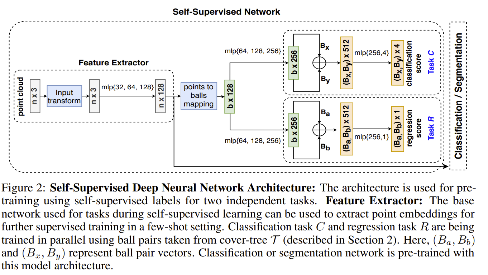

### 00. Title
Self-Supervised Few-Shot Learning on Point Clouds
### 01. Authors
Charu Sharma, Manohar kaul (India Institute of Technology)
### 02. Background
Supervised learning leads to the cumbersome task of annotating the point clouds.

There exists two broad categories of methods that learn representations from point clouds. one is to convert raw point clouds to voxel-grid representations. The other is to learn the representations directly. Both have limitations. The first one introduces unwanted quantization artifacts, the latter suffer from the burden of manually annotating massive point cloud data.

### 03. Contributions
Represent the point clouds as a sequence of progressively finer coverings (cover tree), get finer as the cover-tree is descended. Propose regression and classification self-supervised pre-training tasks that encode a hierarchical partitioning of the point clouds using a cover-tree, where point cloud subsets lie within balls of varying radii at each level of the cover-tree.
### 04. Implementation Details
1. Ball vector is the centroid of the point embedding belonging to the ball;
2. classification is to classify the quadrant class label;
3. regression task trains to predict the l2-norm distance between balls in the ball pair;

### 05. Questions
what's my questions

### 06. Further Reading

What is Cover Tree